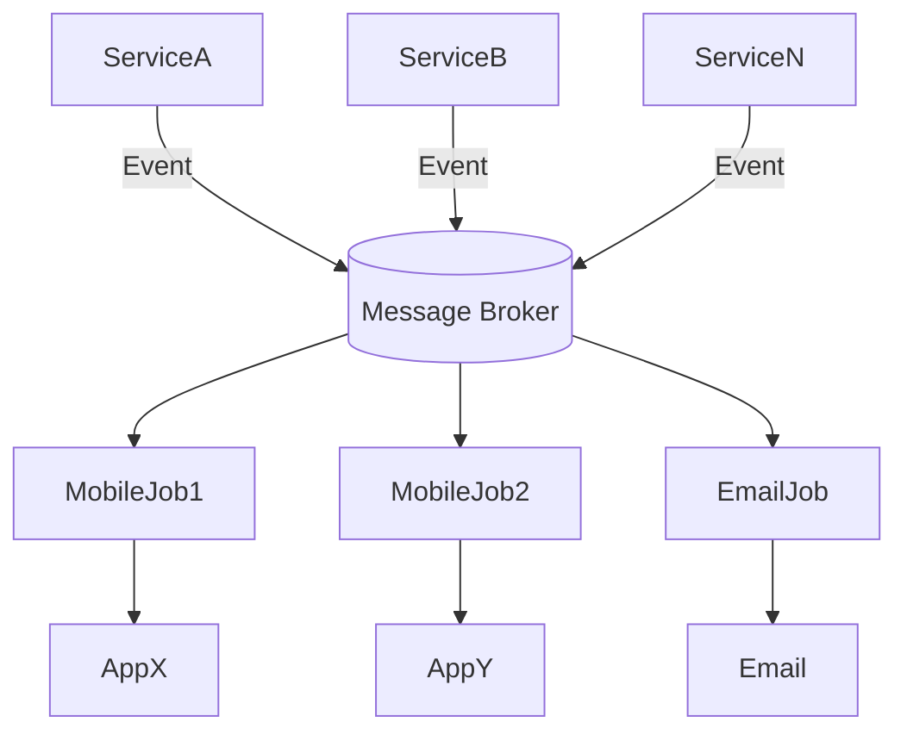
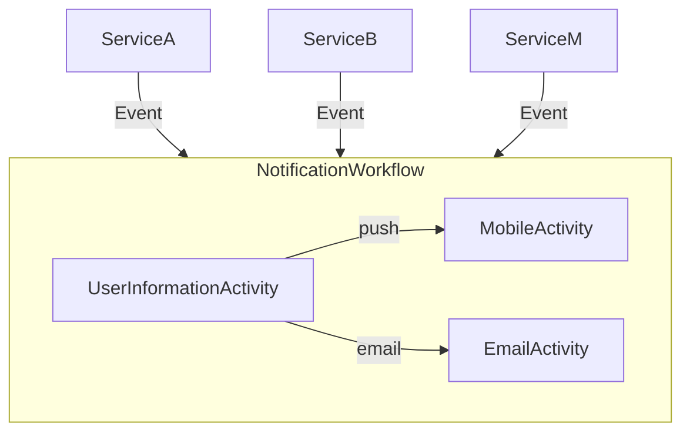

# Notification HUB

> ...
>
> A frequent requirement is for sending push notification to the users through their mobile application when an
> event of interest occurs in the backend systems.
>
> ...

# Architecture



# Temporal



## Parallel Activity Execution

https://github.com/temporalio/samples-go/blob/6b93fe45a8824a56ac70f30832d262b94921a80d/goroutine/goroutine_workflow.go#L18

```go

func SampleGoroutineWorkflow(ctx workflow.Context, parallelism int) (results []string, err error) {
    ao := workflow.ActivityOptions{
		StartToCloseTimeout: 10 * time.Second,
	}
	ctx = workflow.WithActivityOptions(ctx, ao)

	for i := 0; i < parallelism; i++ {
		input1 := fmt.Sprint(i) // Should be outside lambda to be captured correctly
		// Start a goroutine in a workflow safe way
		workflow.Go(ctx, func(gCtx workflow.Context) {
			// It is important to use the context passed to the goroutine function
			// An attempt to use the enclosing context would lead to failure.
			var result1 string
			err = workflow.ExecuteActivity(gCtx, Step1, input1).Get(gCtx, &result1)
			if err != nil {
				// Very naive error handling. Only the last error will be returned by the workflow
				return
			}
			var result2 string
			err = workflow.ExecuteActivity(gCtx, Step2, result1).Get(gCtx, &result2)
			if err != nil {
				return
			}
			results = append(results, result2)
		})
	}

	// Wait for Goroutines to complete. Await blocks until the condition function returns true.
	// The function is evaluated on every workflow state change. Consider using `workflow.AwaitWithTimeout` to
	// limit duration of the wait.
	_ = workflow.Await(ctx, func() bool {
		return err != nil || len(results) == parallelism
	})
}
```


# References

- [Microsoft Learn - Notification HUB](https://learn.microsoft.com/en-us/azure/notification-hubs/notification-hubs-enterprise-push-notification-architecture)
