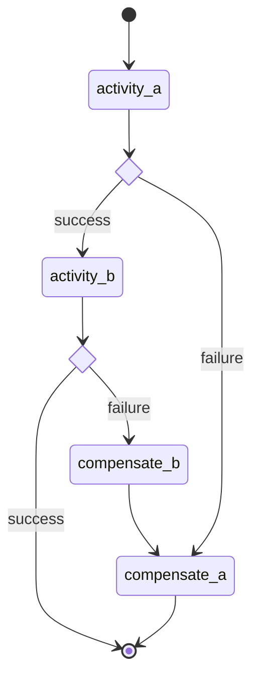

# Sagas

```mermaid
stateDiagram-v2
    [*] --> activity_a
    state if_stateA <<choice>>
    state if_stateB <<choice>>
    activity_a --> if_stateA
    if_stateA --> activity_b : success
    if_stateA --> compensate_a : failure
    activity_b --> if_stateB
    if_stateB --> [*] : success
    if_stateB --> compensate_b : failure
    compensate_b --> compensate_a
    compensate_a --> [*]
```

